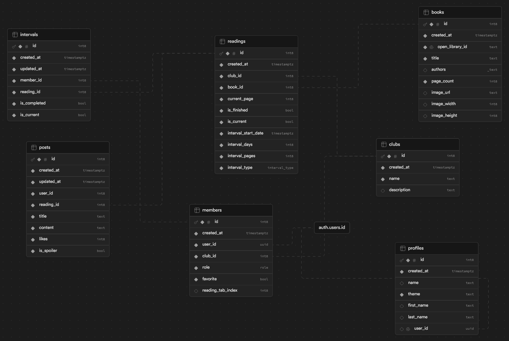

<h1 align="center">🔖 thispage - a simple book club app 🔖</h1>

still in development - check back soon!

## features

- **book clubs**
  - users can be members of multiple book clubs
  - roles and moderation
    - moderators can remove posts/comments and kick/ban members
    - admins can alter book club settings, create/edit readings and send invite links
  - **readings**
    - clubs can read multiple books at once
    - customizable interval periods with page goals for each interval
      - interval advancement types
        - by interval count (10 pages every 7 days)
        - by member completion (move to next interval after all members have finished reading 10 pages)
    - discussion board with posts, likes and comments
      - spoiler posts (hidden when member hasn't completed interval)
    - optional member participation
- **users**
  - sign in with google, apple or email with supabase auth
  - theme selection

## stack

- framework
  - [next.js](https://nextjs.org)
- database, auth, and rls
  - [supabase](https://supabase.com/)
- schema validation
  - [zod](https://zod.dev/)
- styling
  - [tailwind css](https://tailwindcss.com)
  - [shadcn/ui](https://ui.shadcn.com/)
- hosting
  - [vercel](https://vercel.com/)
- database seeding
  - [snaplet](https://www.snaplet.dev/)

## entity relationship diagram

